<a id="readme-top"></a>

[![Contributors][contributors-shield]][contributors-url]
[![Forks][forks-shield]][forks-url]
[![Stargazers][stars-shield]][stars-url]
[![Issues][issues-shield]][issues-url]


<br />
<h3 align="center">Genesys 2 Kintex-7 Petalinux Build</h3>

  <p align="center">
    This is the main Petalinux files used to build Linux on the Genesys 2
    Kintex-7 from Digilent based on Vivado 2025.1
  </p>


  <p align="center">
    <a href="https://github.com/Bodanor/Genesys2-Petalinux-Project/issues/new?labels=bug&template=bug-report---.md">Report Bug</a>
    &middot;
    <a href="https://github.com/Bodanor/Genesys2-Petalinux-Project/issues/new?labels=enhancement&template=feature-request---.md">Request Feature</a>

  </p>
<!-- TABLE OF CONTENTS -->
<details>
<summary>Table of Contents</summary>
  <ol>
    <li><a href="#about-the-project">About The Project</a></li>
    <li>
      <a href="#getting-started">Getting Started</a>
      <ul>
        <li><a href="#prerequisites">Prerequisites</a></li>
      </ul>
    </li>
    <li><a href="#building-linux">Building Linux</a></li>
      <ul>
        <li><a href="#option-1-that-uses-this-repository">Using this repo</a></li>
        <li><a href="#option-2-using-the-provided-bsp">Using the .BSP file</a></li>
      </ul>
    <li><a href="#running-linux-via-jtag">Running Linux via JTAG</a></li>
    <li><a href="#flashing-linux-on-the-on-board-memory">Flashing Linux on the on-board memory</a></li>
    <li><a href="#results">Results</a></li>
    <li>
      <a href="#roadmap">Roadmap</a>
      <ul>
        <li><a href="#implemented">Implemented</a></li>
        <li><a href="#planned">Planned</a></li>
    </ul>
    </li>
    <li><a href="#contributing">Contributing</a></li>
    <li><a href="#contact">Contact</a></li>
  </ol>
</details>


<!-- ABOUT THE PROJECT -->
## About The Project

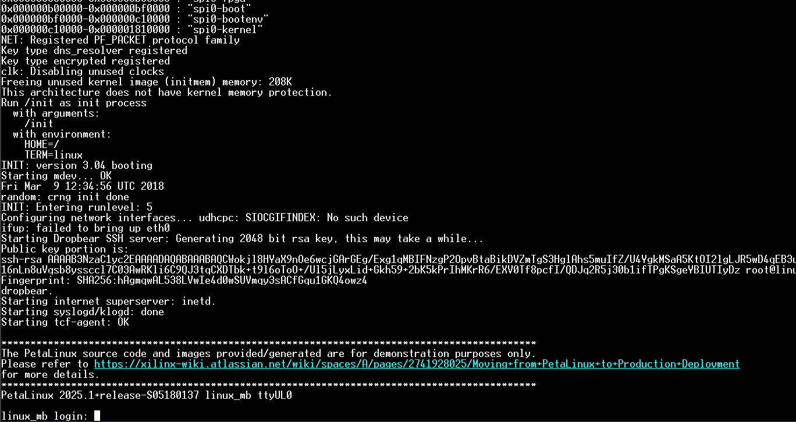

The goal for this is to provide to developers of base config needed in order to generate the actual Linux binary and make it boot successfully on the Genesys 2. Developers are therefore free to add things on top of this base config.


<!-- GETTING STARTED -->
## Getting Started

There are 2 paths to take before continue on reading this long readme. Either, you want to just get a copy of the actual binary and flash it on the onboard memory or, you want to go through the pain of building the whole thing and add things (for instance a different rootfs that contains other utilities).

The main other reason to pick the option to download the **.MCS** file and not build the binary is if you don't have Vivado installed on your Linux Machine. Vivado is unfortunately needed to generate the file to be flashed on the on-board memory. However, if you just want to boot from JTAG, then Vivado is not needed and you still have the option to build Linux.

For the ones who whish to just get a copy of the binary, you shall see in the [release-tab] a file with an extension of **.mcs**. This is the main file that should be flashed on your onboard memory. Therefore you don't need to continue on reading the following instructions as your journey stops here. Unless you don't know how to flash the memory, I suggest you reading tis part of the readme on how to do so. 

For the more adventurous among you, there exists 2 paths you can take on to build the image.

1. Clone this repository that contains the necessary config and patched files (Device-tree, memory offsets, ...)
2.  Use the provided **.bsp** file that you shall find in the [release-tab].

To be honest with you, both of them results in producing the same **.mcs** needed in the end. The difference is that the **.bsp** file contains predownloaded things that petalinux needs as well as a prebuild of Linux, resulting in a slightly faster build time. The main reason to include the pre-build is for the ones for who just want to run Linux via JTAG and don't want to bother building Linux. You just have to pick one :)

<p align="right">(<a href="#readme-top">back to top</a>)</p>


### Prerequisites

* **<ins>Vivado 2025.1 Design suite (only to generate the MCS)** </ins>

  Vivado is saldy needed only if you plan on generating the **MCS** file. If you only plan on booting from JTAG, then Vivado is not needed at all !

* **<ins>Petalinux** </ins>
  
  Explain how to install petalinux.

  <p align="right">(<a href="#readme-top">back to top</a>)</p>

## Building Linux

Before explaining the 2 options you can take, there is a step that is common in both of them and that we need to make sure it done. 

We need to make sure that our current terminal can use the petalinux scripts/binaries. In order to do that, we can use the command bellow, in order to tell Bash where to find those utilities in your system.

```sh
source <pat_to_your_petalinux_install/settings.sh
```
This will effectively tell bash where to find the main commands we need in order to compile Linux.

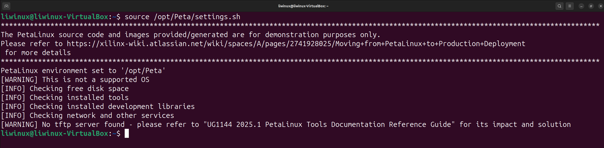

<p align="right">(<a href="#readme-top">back to top</a>)</p>

### Option 1 that uses this repository

1. Clone the repo using HTTPS or SSH.

   ```sh
   # HTTPS
   git clone --recurse-submodules https://github.com/Bodanor/Genesys2-Petalinux-Project.git
   # SSH
   git clone --recurse-submodules git@github.com:Bodanor/Genesys2-Petalinux-Project.git
   ```

   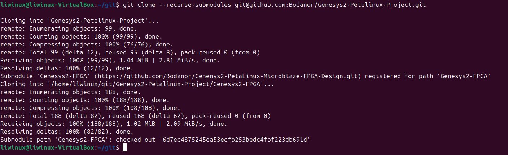

2. Change your working directory to where you cloned this repo

   ```bash
    cd <path_to_where_this_repo_has_been_cloned>
   ```

   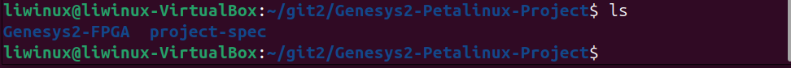


3. Build the thing !

   Yeah indeed, it's just as easy as entering the command bellow :
   ```sh
   petalinux-build
   ```
    Now you are free to take another cup of coffee while you are waiting for petalinux to do it's magic. You should see a similar successfull terminal output as bellow

    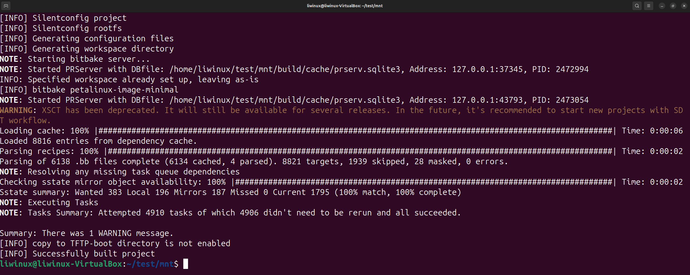


<p align="right">(<a href="#readme-top">back to top</a>)</p>


### Option 2 using the provided **.bsp**

1. Download the needed file.

    Look into the [release-tab] and download the **.BSP** file.

2. Create a petalinux project based on the **.BSP** file.
    
    Run the following command in order to create the project:
    ```sh
    petalinux-create project -s <downloaded_file.bsp>
    ```

    From this point, the project already contains the necessary files to boot from JTAG as well as the final file **.MCS** needed in order to flash the on-board memory.

    In that case you can stop here and follow the steps below to either boot from JTAG or QSPI. Otherwise, you can make some changes and build Linux again using this command :
3. Building the binary:

    ```sh
    petalinux-build
    ```
    
    


<!-- USAGE EXAMPLES -->
## Running Linux via JTAG

  > [!NOTE]
  > This step can be followed only if you have either built Linux or have just downloaded the **.BSP** file and at least create a petalinux project

  Once you have built linux successfully, you should see in the build directory, the artifacts needed for Linux to boot.

  The fist thing you should check is if the jumper is set at the right position on your board as also plugging the board to your computer (jtag and UART). Please refer to this [guide-from-digilent] in order to set the jumper at the right position for JTAG programming.

  Once, that's done, stay in the same folder where you built Linux and run the following command:

  ```sh
  petalinux-boot --jtag --fpga --kernel
  ```
  This command will simply download the kernel to the board and start booting it.

  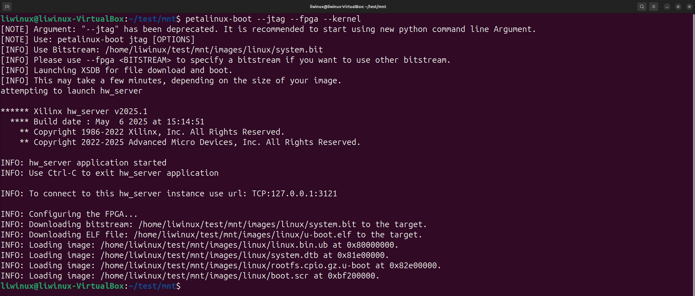

  You should then see the output of U-boot on the UART terminal appearing
  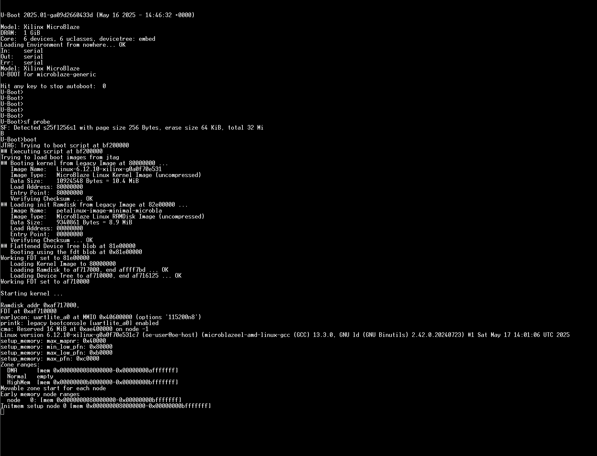

  <p align="right">(<a href="#readme-top">back to top</a>)</p>

## Flashing Linux on the on-board memory

  > [!NOTE]
  > This step can be followed only if you have either built Linux or have just downloaded the **.BSP** file and at least create a petalinux project

This step is for ones who wants their board to automatically boot on Linux without plugging it first to the computer and downloading the image via JTAG.

Same as in the JTAG programming step, you have to make sure that the jumper is set at the correct position for QSPI boot. If you have clue where this jumper is, please follow this [guide-from-digilent] in order to set it correctly.


Once Linux is built or you have used the **.bsp** file directly, you first need to again tell bash where to find the binaries that comes preinstalled with Vivado. You must therefore source them using the bellow command :
```sh
source <path_to_where_vivado_is_installed>/Vivado/settings64.sh
```
Once this is done, you can run the bellow command in order to generate the **.MCS** file

```sh
  petalinux-package boot --fpga --u-boot --kernel --flash-size=256
```
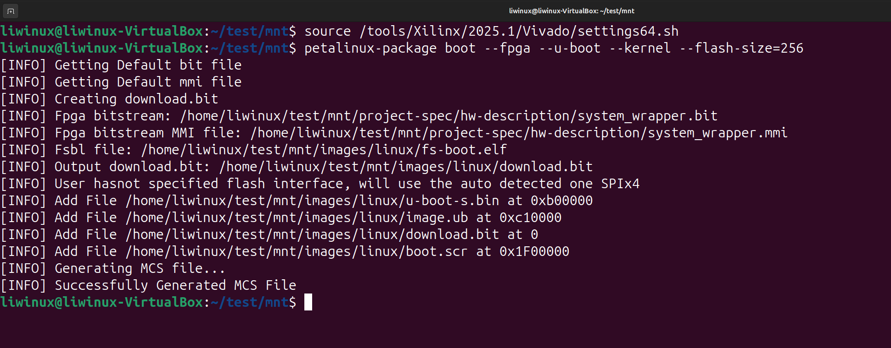
You should now see a file ending with the extension of **.MCS**. This is the file that contains the *FSBL, Linux Kernel, U-boot and device-tree*.

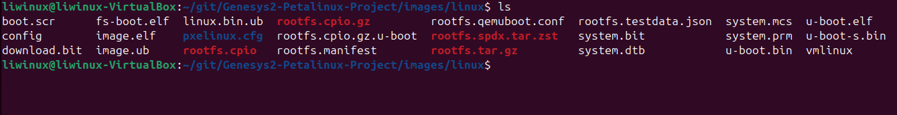

The last step now is to flash this file to board. To do so, first open Vivado and add a memory device in the device manager from within Vivado.

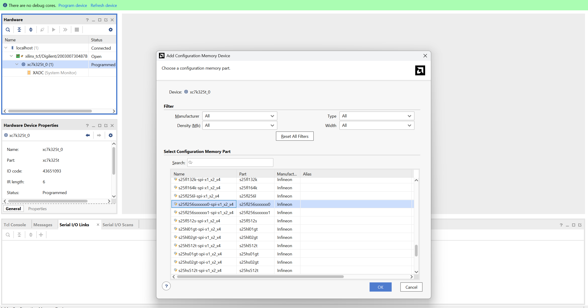

You now make sure you checked the option as in the screenshot below and then wait for it to finish

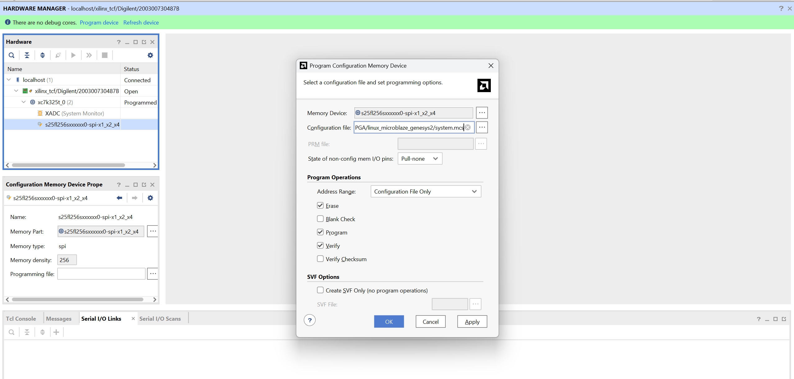

That's it ! You now have flashed Linux into your on-board memory. In fact, if you reboot the board or reset it, you'll see it automatically fetch the image from the QSPI nor and see the booting output on the UART terminal :)

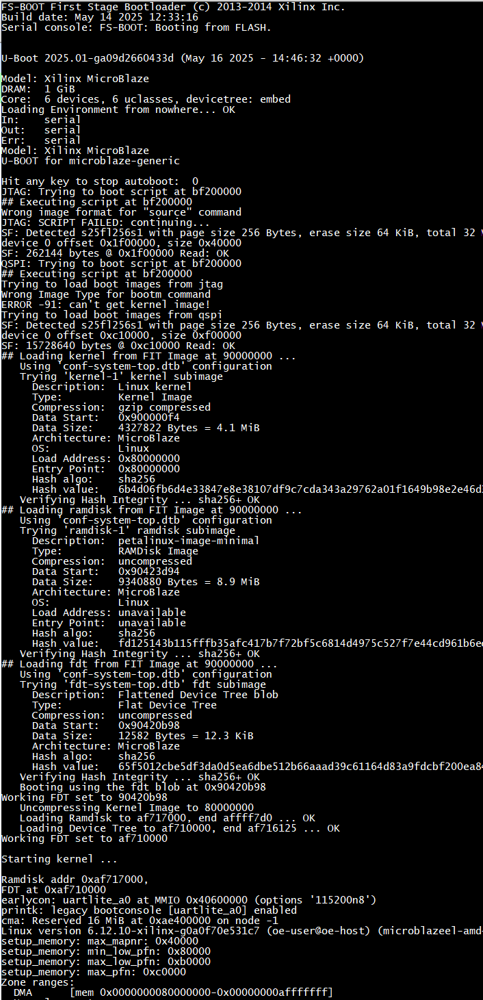

<p align="right">(<a href="#readme-top">back to top</a>)</p>

## Results

  No matter which path you took, you should now see an output similar to this in the UART terminal

  
<!-- ROADMAP -->
## Roadmap

### <ins> Implemented 
- [X] Booting from QSPI Nor

### <ins> Planned
- [ ] Add Networking support
- [ ] Add non-volatile rootfs

See the [open issues](https://github.com/Bodanor/Genesys2-Petalinux-Project/issues) for a full list of proposed features (and known issues).

<p align="right">(<a href="#readme-top">back to top</a>)</p>


<!-- CONTRIBUTING -->
## Contributing

Any controbution to this project is very much appreciated. Please don't hesitate to fork this and create a pull request. Same goes for any issues. 

<p align="right">(<a href="#readme-top">back to top</a>)</p>

### Top contributors:

<a href="https://github.com/Bodanor/Genesys2-Petalinux-Project/graphs/contributors">
  
</a>

<!-- CONTACT -->
## Contact
[Christos Papadopoulos][linkedin-url] - papadopoulos.chris@icloud.com

Project Link: [https://github.com/Bodanor/Genenys2-PetaLinux-Microblaze-FPGA-Design](https://github.com/Bodanor/Genenys2-PetaLinux-Microblaze-FPGA-Design)

<p align="right">(<a href="#readme-top">back to top</a>)</p>


<!-- MARKDOWN LINKS & IMAGES -->
<!-- https://www.markdownguide.org/basic-syntax/#reference-style-links -->
[contributors-shield]: https://img.shields.io/github/contributors/Bodanor/Genesys2-Petalinux-Project.svg?style=for-the-badge
[contributors-url]: https://github.com/Bodanor/Genesys2-Petalinux-Project/graphs/contributors
[forks-shield]: https://img.shields.io/github/forks/Bodanor/Genesys2-Petalinux-Project.svg?style=for-the-badge
[forks-url]: https://github.com/Bodanor/Genesys2-Petalinux-Project/network/members
[stars-shield]: https://img.shields.io/github/stars/Bodanor/Genenys2-PetaLinux-Microblaze-FPGA-Design.svg?style=for-the-badge
[stars-url]: https://github.com/Bodanor/Genesys2-Petalinux-Project/stargazers
[issues-shield]: https://img.shields.io/github/issues/Bodanor/Genesys2-Petalinux-Project.svg?style=for-the-badge
[issues-url]: https://github.com/Bodanor/Genesys2-Petalinux-Project/issues
[product-screenshot]: images/Block_design.png
[release-tab]: https://github.com/Bodanor/Genesys2-Petalinux-Project/releases
[linkedin-shield]: https://img.shields.io/badge/-LinkedIn-black.svg?style=for-the-badge&logo=linkedin&colorB=555
[guide-from-digilent]: https://digilent.com/reference/programmable-logic/genesys-2/reference-manual
[linkedin-url]: https://www.linkedin.com/in/christos-papadopoulos-a715392a5/